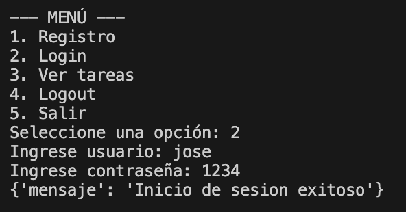

## Descripción del Proyecto

Este proyecto consiste en una **API REST** desarrollada con **Flask** para la gestión de usuarios y autenticación, junto con un **cliente de consola** para interactuar con dicha API. La persistencia de los datos de usuarios se maneja mediante una base de datos **SQLite**.

### Requisitos del Sistema

Para ejecutar este proyecto, necesitas tener instalado:

* Python 3.x
* Las librerías listadas en `requirements.txt`


## Instalación y Ejecución

Sigue estos pasos para levantar el servidor y el cliente.

### 1. Crear y Activar el Entorno Virtual

```bash
python3 -m venv venv
# En Windows:
.\venv\Scripts\activate
# En Linux/macOS:
source venv/bin/activate
```

### 2. Instalar Dependencias
Instala todas las librerías necesarias usando el archivo requirements.txt

```bash
pip install -r requirements.txt
```

### 3. Iniciar el Servidor 
Desde el directorio donde se encuentra server.py

```bash
python3 server.py
```
El servidor se ejecutará en http://127.0.0.1:5000.

### 4. Iniciar el Cliente de Consola
Abre una segunda terminal y ejecuta el cliente para interactuar con la API.

```bash
python3 client.py
```
El cliente mostrará el menú principal para registrar, iniciar sesión o acceder a tareas.

## Documentación de Endpoints

| Endpoint | Método | Función | Parámetros (Body JSON) | Respuesta Exitosa |
| :--- | :--- | :--- | :--- | :--- |
| `/registro` | `POST` | Registra un nuevo usuario | `{"username": "nombre", "password": "1234"}` | `{"mensaje": "Usuario registrado con exito"}` (201) |
| `/login` | `POST` | Inicia sesión y establece la cookie de sesión | `{"username": "nombre", "password": "1234"}` | `{"mensaje": "Inicio de sesion exitoso"}` (200) |
| `/tareas` | `GET` | Muestra la página de bienvenida (requiere sesión activa) | N/A | Contenido HTML de bienvenida (200) |
| `/logout` | `POST` | Cierra la sesión activa | N/A | `{"mensaje": "Sesión cerrada"}` (200) |

## Pruebas 

1. Registro de Usuario Exitoso


2. Inicio de Sesión Exitoso



3. Acceso a /tareas con Sesión Activa


4. Acceso Denegado a /tareas sin Sesión


5. Cierre de Sesión (Logout)

